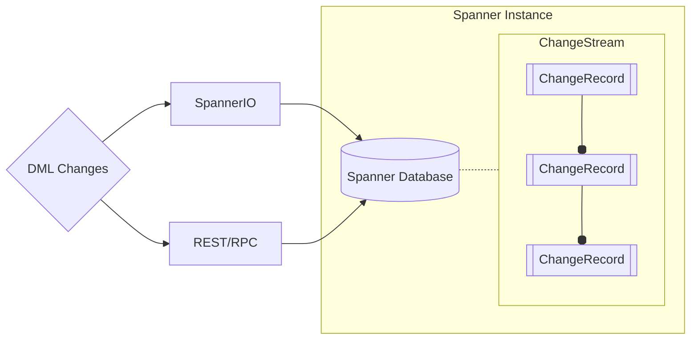
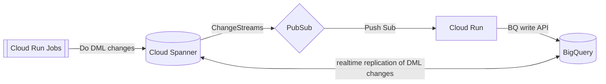

# Proof of Concept: Cloud Spanner Change Streams

### Purpose: Realtime Data Replication between Cloud Spanner & BigQuery

|              | Cloud Spanner             | BigQuery                     | 
|--------------|---------------------------|------------------------------|
| Processing   | OLTP (Read/Write)         | OLAP (Read)                  |
| Purpose      | Transactions (Operations) | Data Warehousing (Analytics) |
| Availability | Multi-regional            | Single Region                |

## Architecture
### Spanner Change Streams Basics

