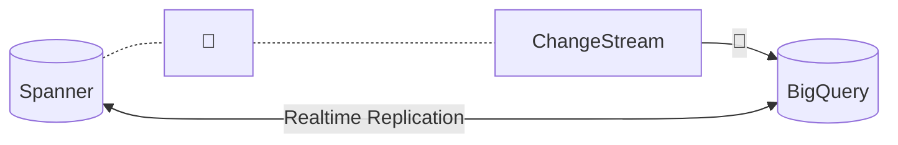
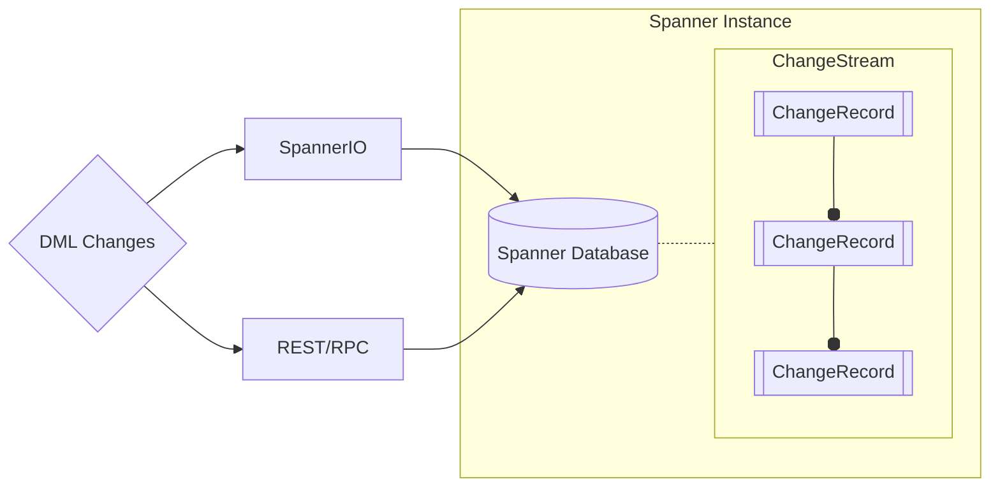
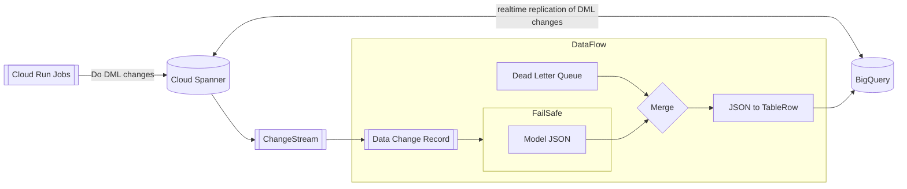

# Proof of Concept: Cloud Spanner Change Streams

### Purpose: Realtime Data Replication between Cloud Spanner & BigQuery

#### Spanner vs BigQuery

|              | Cloud Spanner             | BigQuery                     | 
|--------------|---------------------------|------------------------------|
| Processing   | OLTP (Read/Write)         | OLAP (Read)                  |
| Purpose      | Transactions (Operations) | Data Warehousing (Analytics) |
| Availability | Multi-regional            | Single Region                |

**Cloud Spanner** 

An RDBMS, designed for transactional workloads (insert, update) that require high reliability, and availability on a massive (unlimited) scale. 

Spanner is perfect for e-commerce (AusPost parcel tracking), banking, etc. But exhibits (very, very) poor performance for analytical workloads (don't even try to `GROUP BY`).

**BigQuery** 

A columnar formatted (non-relational) Data Warehousing solution.

BQ is an absolute no-brainer for any kind of BI/Analytics application, but is terrible for transactional workloads. It does not handle `UPDATE` queries very well (columnar structure requires each column of a record to be retrieved individually).

#### Desired Outcome

|              | Cloud Spanner             | BigQuery                     | 
|--------------|---------------------------|------------------------------|
| Processing   | OLTP (Read/Write)         | OLAP (Read)                  |
| Purpose      | Transactions (Operations) | Data Warehousing (Analytics) |
| Availability | Multi-regional            | Single Region                |

## Architecture
### Spanner Change Streams Basics

---

### Change Stream to BigQuery "Out of the Box" DataFlow Template
